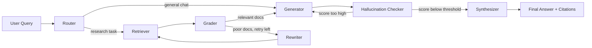

# PaperRadar-Agent 项目说明

PaperRadar-Agent 是一个面向论文调研、选题追踪和简历项目展示的中文科研 Agent。它基于 LangGraph 组织 Agentic RAG 流程，把论文检索、相关性评分、查询改写、结构化报告生成、幻觉检查、引用整理和长期记忆串成一条可观测的工作流。

项目支持 mock 演示模式和真实检索模式。mock 模式不需要 API key，适合本地展示、面试讲解和跑测试；真实模式可以接入 DeepSeek、Qwen/DashScope 或 Gemini，并调用 arXiv、PubMed、OpenAlex、IEEE 等论文源。

## 项目截图


## 核心功能

- 中文论文雷达报告：输入研究方向后输出方向概览、方法路线、代表论文、近年趋势、研究空白、两周阅读路线和小项目建议。
- LangGraph Agent 流程：Router、Retriever、Grader、Rewriter、Generator、Hallucination Checker、Synthesizer。
- 多源论文检索：支持 arXiv、PubMed、OpenAlex，并可选 IEEE Xplore。
- 相关性过滤：先检索候选论文，再由 grader 筛选更适合回答用户问题的文献。
- 查询改写：当检索结果质量不足时，自动改写 query 后重新检索。
- 幻觉检查：对生成答案进行 groundedness 检查，分数越高表示越可能脱离来源文档。
- 引用整理：最终答案使用 `[1]`、`[2]` 形式引用来源论文，并清理无效引用。
- 长期记忆：保存用户关注主题、待读论文、历史检索和聊天会话摘要。
- 前端可视化：展示聊天历史、论文卡片、引用来源和 Agent 执行步骤。

## 技术栈

- 后端：FastAPI、LangGraph、LangChain Core、Pydantic、httpx
- 检索：arXiv API、PubMed E-utilities、OpenAlex、IEEE Xplore
- 向量库：ChromaDB
- Embedding：sentence-transformers
- LLM Provider：mock、DeepSeek、Qwen/DashScope、Gemini
- 前端：Next.js、React、Tailwind CSS、Framer Motion、lucide-react
- 部署：Docker、Docker Compose

## 工作流说明



核心理解：每个节点都通过 `AgentState` 共享状态，不直接把复杂对象互相传来传去。`state` 中会逐步积累 `query`、`documents`、`graded_documents`、`answer`、`citations`、`steps`、`hallucination_score` 和 `memory_context`。

## 本地安装

建议使用 Python 3.11 或 3.12，Node.js 建议使用 18+。

### 1. 克隆项目

```powershell
git clone https://github.com/shinegami-2002/scholar-agent.git
cd scholar-agent
```

### 2. 后端安装

```powershell
cd backend
python -m venv .venv
.\.venv\Scripts\Activate.ps1
python -m pip install --upgrade pip
python -m pip install -e .
copy .env.example .env
```

默认 `.env.example` 使用 mock 模式：

```env
LLM_PROVIDER=mock
```

启动后端：

```powershell
uvicorn app.main:app --reload
```

后端默认地址：

```text
http://localhost:8000
```

健康检查：

```text
http://localhost:8000/health
```

### 3. 前端安装

打开新的终端：

```powershell
cd frontend
npm install
npm run dev
```

前端默认地址：

```text
http://localhost:3000
```

如果国内网络较慢，可以使用镜像：

```powershell
npm install --registry=https://registry.npmmirror.com
```

## 真实检索模式

mock 模式适合演示，但不会真实调用论文源和大模型。真实模式需要安装额外依赖：

```powershell
cd backend
.\.venv\Scripts\Activate.ps1
python -m pip install -e ".[rag]"
python -m pip install -e ".[providers]"
```

DeepSeek 示例：

```env
LLM_PROVIDER=deepseek
LLM_MODEL_ID=deepseek-chat
LLM_API_KEY=你的_key
LLM_BASE_URL=https://api.deepseek.com
```

Qwen/DashScope 示例：

```env
LLM_PROVIDER=qwen
LLM_MODEL_ID=qwen-plus
LLM_API_KEY=你的_key
LLM_BASE_URL=https://dashscope.aliyuncs.com/compatible-mode/v1
```

Gemini 示例：

```env
LLM_PROVIDER=gemini
LLM_API_KEY=你的_key
LLM_MODEL_ID=gemini-2.5-flash
```

注意：不要把真实 `.env`、API key、Chroma 数据库、日志文件上传到 GitHub。

## Docker 使用

如果希望用容器启动：

```powershell
docker compose up --build
```

服务地址：

```text
前端：http://localhost:3000
后端：http://localhost:8000
```

如果使用 Docker Compose，请在项目根目录准备 `.env`，或者根据需要修改 `docker-compose.yml` 的 `env_file`。

## 日常使用说明

1. 启动后端：

```powershell
cd backend
.\.venv\Scripts\Activate.ps1
uvicorn app.main:app --reload
```

2. 启动前端：

```powershell
cd frontend
npm run dev
```

3. 打开浏览器访问：

```text
http://localhost:3000
```

4. 在输入框中输入研究方向，例如：

```text
Agentic RAG 方向论文雷达：趋势、代表论文、研究空白和两周阅读路线
```

5. 查看输出内容：

- 左侧可以查看历史聊天会话。
- 主区域展示中文 PaperRadar 报告。
- 论文卡片展示标题、作者、摘要、来源和链接。
- Thinking Steps 展示 Router、Retriever、Grader、Generator 等节点的执行轨迹。
- 引用列表把 `[1]`、`[2]` 和来源论文对应起来。

## 常用演示问题

```text
Agentic RAG 方向论文雷达：趋势、代表论文、研究空白和两周阅读路线
```

```text
LLM Agent 长期记忆机制论文雷达
```

```text
RAG Hallucination Evaluation 的研究趋势、代表论文和小项目建议
```

```text
Graph Contrastive Learning 推荐系统方向论文雷达
```

## LangGraph Studio

项目根目录提供了 `langgraph.json`，可以用 LangGraph Studio 查看节点和状态流转。

```powershell
cd backend
.\.venv\Scripts\Activate.ps1
python -m pip install -e ".[studio]"
cd ..
$env:PYTHONUTF8="1"
$env:PYTHONIOENCODING="utf-8"
.\backend\.venv\Scripts\langgraph.exe dev --allow-blocking --no-browser --port 2024 --config langgraph.json
```

打开：

```text
https://smith.langchain.com/studio/?baseUrl=http://127.0.0.1:2024
```

## 测试与验证

后端测试：

```powershell
cd backend
.\.venv\Scripts\Activate.ps1
python -m pip install -e ".[test]"
pytest
```

mock 模式烟测：

```powershell
python scripts/smoke_paper_radar.py
```

报告质量烟测：

```powershell
python scripts/smoke_report_quality.py
```

Provider 检查：

```powershell
python scripts/smoke_provider.py
```

前端构建：

```powershell
cd frontend
npm run build
```

## 目录说明

```text
backend/app/main.py                 FastAPI 入口和 API 路由
backend/app/agents/graph.py         LangGraph 流程编排
backend/app/agents/state.py         AgentState 状态结构
backend/app/agents/nodes/           Router/Retriever/Grader/Generator 等节点
backend/app/services/               LLM、检索、记忆、向量库等服务
backend/app/models/schemas.py       请求和响应数据模型
frontend/app/page.tsx               前端主页面
frontend/lib/api.ts                 前端 API 调用
frontend/components/                UI 组件
docs/PAPER_RADAR.md                 面试讲法和项目说明
```

## 面试讲法

可以这样概括这个项目：

```text
PaperRadar-Agent 是一个基于 LangGraph 的中文论文雷达与选题追踪 Agent。
我把普通 RAG 拆成 Router、Retriever、Grader、Rewriter、Generator、Hallucination Checker 和 Synthesizer 等节点，让论文检索、相关性过滤、查询改写、结构化生成、幻觉检查和引用整理都可观测、可调试。
项目还支持 mock/real 两种运行模式、DeepSeek/Qwen/Gemini Provider、多源论文检索、JSON 长期记忆和 Next.js 前端展示。
```

## 注意事项

- `.env` 不要提交到 GitHub，只提交 `.env.example`。
- `data/`、`backend/data/`、`.venv/`、`node_modules/`、日志文件都属于本地运行产物，不应上传。
- mock 模式输出稳定，适合面试演示；真实模式受 API key、网络、arXiv 限流等因素影响。
- arXiv 偶尔会返回 429 或 503，项目会尽量使用 OpenAlex 做真实元数据兜底。
