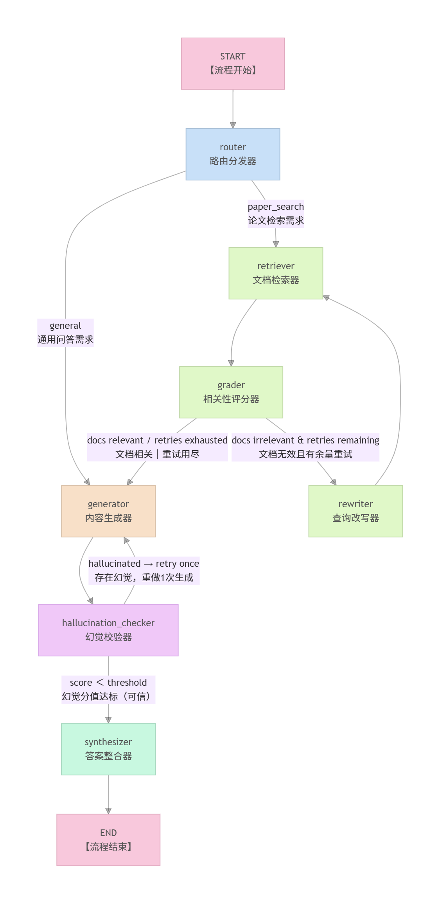

# PaperRadar-Agent

> 一个面向中文科研学习、论文调研和简历项目展示的 PaperRadar Agent。输入一个研究方向，系统会自动检索论文、筛选相关文献、生成结构化中文报告，并给出研究趋势、代表论文、研究空白、两周阅读路线和可落地小项目建议。

PaperRadar-Agent 基于 ScholarAgent 二次开发，核心目标不是做一个普通“论文搜索 + 摘要总结”工具，而是把论文检索、向量召回、相关性评分、查询改写、路线分类、结构化生成、幻觉检查、引用整理和长期记忆串成一个可观测的 LangGraph Agentic RAG 工作流。

这个项目适合两类人：

- 使用者：想快速了解一个研究方向、找到代表论文、整理阅读路线和项目选题。
- 面试官：可以从项目中看到候选人对 RAG、Agent workflow、LLM Provider、前后端工程、测试和可观测性的综合实现能力。

## 项目预览

### 前端界面

<p align="center">
  
</p>

### LangGraph Agent 工作流

<p align="center">
  
</p>

## 项目功能

用户输入一个研究方向，例如：

```text
Agentic RAG 方向论文雷达：趋势、代表论文、研究空白和两周阅读路线
```

系统会返回一份中文 PaperRadar 报告，包含：

- 方向概览：解释研究方向的背景、价值和核心问题。
- 方法路线分类：按 Survey / Taxonomy、Planning / Reasoning、Multi-Agent / Hierarchical、Multimodal RAG、Evaluation / Benchmark、Domain-specific Agentic RAG 等路线组织论文。
- 代表论文推荐：说明哪些论文最值得先读，以及为什么值得读。
- 近年趋势：按时间线或阶段总结技术演进。
- 研究空白：输出具体 gap、现状、缺口、可验证方式和可做项目。
- 两周阅读路线：把学习任务拆成阶段目标、推荐论文和阶段产出。
- 可做小项目建议：给出适合简历展示的 MVP 方案。
- 参考来源：用 `[1]`、`[2]` 等 citation 对齐论文来源。

## 技术亮点

- Agentic RAG 图流程：使用 LangGraph 把检索、评分、改写、生成、校验和整理拆成多个节点。
- 可追踪执行过程：每个节点都会写入 `steps`，前端可以展示 Agent 执行轨迹。
- 多源论文检索：支持 arXiv、PubMed、OpenAlex，并可扩展 IEEE Xplore。
- 查询改写机制：当相关论文不足时自动改写 query，再次进入检索。
- 文档相关性评分：Grader 根据用户问题过滤不相关论文，减少噪声文献进入生成阶段。
- 幻觉检查：Hallucination Checker 对答案 groundedness 打分，分数过高会触发重新生成。
- 引用可追溯：答案中使用 `[1]`、`[2]` 引用，Synthesizer 会清理无效引用并对齐论文来源。
- 长期记忆：保存用户关注主题、待读论文、历史检索和聊天会话摘要。
- 国内模型适配：DeepSeek 和 Qwen/DashScope 使用 OpenAI-compatible API，Gemini 走官方 LangChain Provider。
- 前后端完整闭环：FastAPI 提供接口，Next.js 前端展示报告、论文卡片、引用和历史会话。

## 技术栈

| 模块 | 技术 |
| --- | --- |
| 后端 API | FastAPI、Pydantic、Uvicorn |
| Agent 编排 | LangGraph、LangChain Core |
| LLM Provider | DeepSeek、Qwen/DashScope、Gemini |
| 论文检索 | arXiv、PubMed E-utilities、OpenAlex、IEEE Xplore |
| 向量检索 | ChromaDB、sentence-transformers |
| 前端 | Next.js、React、Tailwind CSS、Framer Motion、lucide-react |
| 长期记忆 | 本地 JSON 文件 |
| 测试 | pytest、respx、FastAPI TestClient |
| 部署 | Docker、Docker Compose |

## 系统架构

项目可以分为四层：

| 层级 | 说明 |
| --- | --- |
| 前端层 | 输入研究问题，展示报告、论文卡片、引用来源、执行步骤和历史会话。 |
| API 层 | FastAPI 提供搜索、翻译、记忆、会话和 WebSocket 接口。 |
| Agent 层 | LangGraph 组织 Router、Retriever、Grader、Rewriter、Generator、Hallucination Checker、Synthesizer。 |
| 服务层 | 封装 LLM 调用、论文检索、向量库、长期记忆、论文分类和角色分配。 |

核心调用链路：

```text
用户输入
  -> Next.js 前端调用 /api/search
  -> FastAPI 构造 SearchRequest
  -> run_search 初始化 AgentState
  -> LangGraph 按条件边执行各节点
  -> 生成 SearchResponse
  -> 前端展示报告、论文、引用和执行步骤
```

## LangGraph 工作流

| 节点 | 作用 |
| --- | --- |
| Router | 判断用户意图，区分普通对话、论文搜索、论文雷达、阅读计划和项目建议。 |
| Retriever | 根据 query 从 arXiv、PubMed、OpenAlex 等来源检索论文。 |
| Grader | 判断检索到的论文是否和用户问题相关。 |
| Rewriter | 当文档相关性不足且还有重试机会时，改写 query 并回到 Retriever。 |
| Generator | 基于筛选后的论文生成中文回答或 PaperRadar 报告。 |
| Hallucination Checker | 对答案做 groundedness 检查，降低脱离论文来源的风险。 |
| Synthesizer | 清理引用、整理最终答案，并写回消息输出。 |

这个图流程的好处是：每一步都能单独测试、单独替换、单独观察。相比一条长 prompt 的做法，LangGraph 更适合表达分支、重试、质量检查和状态追踪。

## PaperRadar 报告标准

项目生成的 PaperRadar 报告不是普通论文列表，而是“方向雷达”。合格报告需要满足：

- 固定覆盖 8 类内容：方向概览、方法路线分类、代表论文推荐、近年趋势、研究空白、两周阅读路线、可做小项目建议、参考来源。
- 方法路线分类要基于真实检索到的论文标题、摘要和元数据，不强行编造没有论文支撑的路线。
- 代表论文推荐不能只是复制摘要，而要解释论文为什么代表该方向。
- 近年趋势需要绑定 citation，尽量说明阶段变化和技术演进。
- 研究空白至少给出 5 个具体 gap，并包含现状、缺口、可验证方式和可做项目。
- 两周阅读路线要按学习目标设计，而不是机械地按论文编号排序。
- 小项目建议要和用户主题强相关，包含目标、核心功能、技术栈、两周 MVP 和简历亮点。
- 参考来源要尽量包含标题、作者、年份、来源和 URL。

## 长期记忆设计

项目采用轻量 JSON 方式实现长期记忆，便于本地运行、调试和面试展示。

| 文件 | 保存内容 |
| --- | --- |
| `backend/data/memory/user_topics.json` | 用户长期关注的研究主题。 |
| `backend/data/memory/saved_papers.json` | 用户收藏或待读的论文。 |
| `backend/data/memory/reading_history.json` | 历史检索、任务类型和 top papers。 |
| `backend/data/memory/chat_sessions.json` | 聊天会话、助手回答、压缩摘要和重要笔记。 |

当会话消息变多时，系统会保留最近消息，并把更早的对话压缩成 `summary` 和 `important_notes`。这样可以避免上下文无限增长，同时让后续报告参考用户历史偏好。

生成报告时，`generator.py` 会把短期 state 和长期 memory 合并为 `memory_context`，再放入生成 prompt 中。短期记忆负责当前检索和当前文档，长期记忆负责用户偏好、保存论文和历史会话。

## 安装与启动

建议环境：

- Python 3.11 或 3.12
- Node.js 18+
- Windows PowerShell、Git Bash 或类 Unix shell

### 1. 克隆项目

```powershell
git clone https://github.com/yangzeha/PaperRadar-Agent.git
cd PaperRadar-Agent
```

### 2. 安装后端

```powershell
cd backend
python -m venv .venv
.\.venv\Scripts\Activate.ps1
python -m pip install --upgrade pip
python -m pip install -e .
copy .env.example .env
```

启动后端：

```powershell
uvicorn app.main:app --reload
```

后端默认地址：

```text
http://localhost:8000
```

健康检查：

```text
http://localhost:8000/health
```

### 3. 安装前端

打开新的终端：

```powershell
cd frontend
npm install
npm run dev
```

前端默认地址：

```text
http://localhost:3000
```

如果网络较慢，可以使用 npm 镜像：

```powershell
npm install --registry=https://registry.npmmirror.com
```

## 模型配置

在 `backend/.env` 中选择一个 Provider。

### DeepSeek

```env
LLM_PROVIDER=deepseek
LLM_MODEL_ID=deepseek-chat
LLM_API_KEY=你的_key
LLM_BASE_URL=https://api.deepseek.com
```

### Qwen/DashScope

```env
LLM_PROVIDER=qwen
LLM_MODEL_ID=qwen-plus
LLM_API_KEY=你的_key
LLM_BASE_URL=https://dashscope.aliyuncs.com/compatible-mode/v1
```

### Gemini

```env
LLM_PROVIDER=gemini
LLM_API_KEY=你的_key
LLM_MODEL_ID=gemini-2.5-flash
```

真实检索和向量召回依赖：

```powershell
cd backend
.\.venv\Scripts\Activate.ps1
python -m pip install -e ".[rag]"
python -m pip install -e ".[providers]"
```

如果国内网络较慢，可以使用镜像：

```powershell
python -m pip install -e ".[rag]" -i https://pypi.tuna.tsinghua.edu.cn/simple
python -m pip install -e ".[providers]" -i https://pypi.tuna.tsinghua.edu.cn/simple
```

不要把真实 `.env`、API key、Chroma 数据库或日志文件提交到 GitHub。

## 日常使用

1. 启动后端：

```powershell
cd backend
.\.venv\Scripts\Activate.ps1
uvicorn app.main:app --reload
```

2. 启动前端：

```powershell
cd frontend
npm run dev
```

3. 打开页面：

```text
http://localhost:3000
```

4. 输入研究方向：

```text
LLM Agent 长期记忆机制论文雷达
```

5. 查看结果：

- `Research Summary`：生成的中文 PaperRadar 报告。
- `Sources`：引用到的论文来源。
- `Thinking Steps`：Router、Retriever、Grader、Generator 等节点执行过程。
- 左侧会话栏：历史聊天和压缩记忆。
- 论文卡片：标题、作者、摘要、来源和链接。

## 常用演示问题

```text
Agentic RAG 方向论文雷达：趋势、代表论文、研究空白和两周阅读路线
```

```text
LLM Agent 长期记忆机制论文雷达
```

```text
RAG Hallucination Evaluation 的研究趋势、代表论文和小项目建议
```

```text
Graph Contrastive Learning 推荐系统方向论文雷达
```

```text
帮我找近三年 Multi-Agent RAG 相关论文，并按方法路线分类
```

## API 简表

| 接口 | 方法 | 用途 |
| --- | --- | --- |
| `/health` | GET | 健康检查 |
| `/api/provider` | GET | 查看当前 LLM Provider 状态 |
| `/api/search` | POST | 运行完整 Agent 检索和生成流程 |
| `/api/translate` | POST | 翻译生成报告，并保留 Markdown 和引用 |
| `/api/memory/topics` | GET/POST | 读取或更新长期关注主题 |
| `/api/memory/saved-papers` | GET/POST | 读取或保存待读论文 |
| `/api/memory/history` | GET | 读取历史检索记录 |
| `/api/chat/sessions` | GET/POST | 读取或创建聊天会话 |
| `/api/chat/sessions/{session_id}` | GET/DELETE | 读取或删除指定会话 |
| `/ws/search` | WebSocket | 流式返回 Agent 执行步骤和最终结果 |

## LangGraph Studio

项目根目录提供 `langgraph.json`，可以用 LangGraph Studio 查看图结构、节点输入输出和 state 变化。

```powershell
cd backend
.\.venv\Scripts\Activate.ps1
python -m pip install -e ".[studio]"
cd ..
$env:PYTHONUTF8="1"
$env:PYTHONIOENCODING="utf-8"
.\backend\.venv\Scripts\langgraph.exe dev --allow-blocking --no-browser --port 2024 --config langgraph.json
```

打开：

```text
https://smith.langchain.com/studio/?baseUrl=http://127.0.0.1:2024
```

## Docker 使用

```powershell
docker compose up --build
```

服务地址：

```text
前端：http://localhost:3000
后端：http://localhost:8000
```

## 测试与验证

后端测试：

```powershell
cd backend
.\.venv\Scripts\Activate.ps1
python -m pip install -e ".[test]"
pytest
```

报告质量烟测：

```powershell
python scripts/smoke_report_quality.py
```

Provider 检查：

```powershell
python scripts/smoke_provider.py
```

真实检索烟测：

```powershell
python scripts/smoke_real_retrieval.py
```

前端构建：

```powershell
cd frontend
npm run build
```

## 目录结构

```text
backend/app/main.py                 FastAPI 入口和 API 路由
backend/app/agents/graph.py         LangGraph 流程编排
backend/app/agents/state.py         AgentState 状态定义
backend/app/agents/nodes/           Router/Retriever/Grader/Generator 等节点
backend/app/services/               LLM、检索、记忆、向量库等服务
backend/app/models/schemas.py       请求和响应数据模型
backend/tests/                      后端测试
frontend/app/page.tsx               前端主页面
frontend/lib/api.ts                 前端 API 调用
frontend/components/                前端组件
docs/PAPER_RADAR.md                 PaperRadar 项目讲法与设计说明
remark.md                           面向使用者和面试官的项目说明
```

## 建议阅读顺序

如果你是面试官或第一次看这个项目，可以按下面顺序读代码：

1. `backend/app/main.py`：理解 FastAPI 如何接收请求。
2. `backend/app/agents/graph.py`：理解 LangGraph 节点和条件边。
3. `backend/app/agents/state.py`：理解 AgentState 中有哪些状态字段。
4. `backend/app/agents/nodes/router.py`、`retriever.py`、`grader.py`：理解任务分类、论文检索和相关性过滤。
5. `backend/app/agents/nodes/generator.py`、`hallucination_checker.py`、`synthesizer.py`：理解生成、幻觉检查和引用整理。
6. `backend/app/services/memory_store.py`：理解长期记忆如何保存和压缩。
7. `frontend/app/page.tsx`、`frontend/lib/api.ts`：理解前端如何调用后端并展示结果。

## 面试讲法

可以这样概括项目：

```text
PaperRadar-Agent 是一个基于 LangGraph 的中文论文雷达与选题追踪 Agent。我把普通 RAG 拆成 Router、Retriever、Grader、Rewriter、Generator、Hallucination Checker 和 Synthesizer 等节点，让论文检索、相关性过滤、查询改写、结构化生成、幻觉检查和引用整理都可观测、可调试。

项目支持 DeepSeek、Qwen 和 Gemini 等 Provider，可以检索 arXiv、PubMed、OpenAlex 等论文源，并用 JSON 长期记忆保存用户关注主题、待读论文、历史检索和会话摘要。相比简单问答系统，它更强调可追踪的 Agent workflow、引用可信度和面向研究方向的结构化输出。
```

面试官如果追问技术难点，可以重点讲：

- 为什么用 LangGraph：图结构更适合表达路由、重试、查询改写和质量检查。
- 如何降低幻觉：生成后用 hallucination score 检查答案是否基于来源论文，分数过高会触发重新生成。
- 如何保证引用可信：Generator 要求生成 `[1]`、`[2]` 引用，Synthesizer 再清理悬空引用。
- 如何做长期记忆：用 JSON 保存主题、论文收藏、历史和会话摘要，轻量透明，适合本地项目展示。
- 如何做工程化：提供 API schema、测试用例、前端展示、Provider 抽象和 LangGraph Studio 可视化。

## 注意事项

- `.env`、API key、`.venv/`、`node_modules/`、`data/`、`backend/data/` 和日志文件不要提交。
- 真实模式会受到 API key、网络和论文源限流影响。
- arXiv 公开端点偶尔会出现 429/503，项目会尽量使用 OpenAlex 作为真实元数据兜底。
- 生成报告仍建议人工复核关键论文和引用，尤其是在正式科研写作中。
